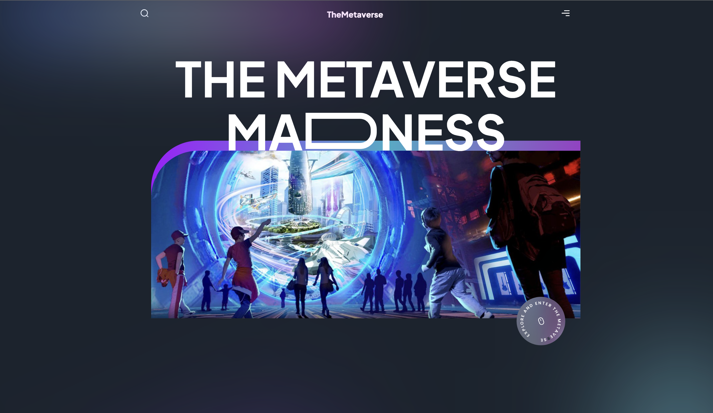

# The Metaverse

## Description
This is a full stack application that allows for a user to enter into the metaverse. 

[Deployed-App](https://github.com/mffonua/Modern-Website)

## Concepts Used

- Node and Express servers
- Handlebars templating
- MVC (Model-View-Controller) design pattern
- NoSQL database
- API endpoints
- HTML URL routing
- Node require and module exports

## Technologies Used
- HTML5/CSS
- BootStrap
- Javascript
- jQuery
- Node.js
- Express.js
- Handlebars.js
- MongoDB
- Mongoose
- Heroku

## Future Development

Future development would involve the following:
The back end.

## Node Packages Used

## Authors
 The Team:

 - **Joseph Vasquez** - [Joseph Vasquez](https://github.com/JosephVasquez592)
 - **Isaac Thorell** - [Isaac Thorell](https://github.com/)
 - **David Paniagua** - [David Paniagua](https://github.com/)
 - **Miles Fonua** - [Miles Fonua](https://github.com/mffonua)